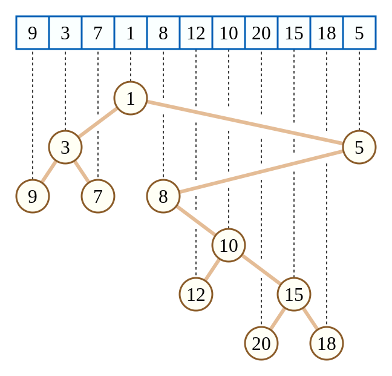

.. index:: 笛卡尔树

笛卡尔树
===========

笛卡尔树是一种二叉树，每一个节点由一个键值二元组 ``(k,w)`` 构成。要求 ``k`` 满足二叉搜索树的性质，而 ``w`` 满足堆的性质。如果笛卡尔树的 ``k,w`` 键值确定，且 ``k`` 互不相同， ``w`` 也互不相同，那么这棵笛卡尔树的结构是唯一的。如下图：

用栈构建笛卡尔树
*****************

    按下标顺序依次插入元素，同时用栈维护树的右链。

    当插入新的元素时，将元素和栈顶元素比较大小（以小根堆为例），将所有大于插入元素数值的栈顶 ``pop`` 掉。

    然后将该元素作为当前栈顶元素的右子树，并将最后一个 ``pop`` 掉的元素作为该元素的左子树。

    最后将当前元素 ``push`` 进栈中。

    持续以上过程。。。

    .. image:: ../_static/算法与数据结构/笛卡尔树/cartesian-tree2.png
        :alt: cartesian-tree2
        :align: center   

`【模板】笛卡尔树 <https://www.luogu.com.cn/problem/P5854>`_
*************************************************************

    .. code-block:: CPP

        #include <bits/stdc++.h>

        int main() {
            std::ios::sync_with_stdio(false);
            std::cin.tie(nullptr);

            int n;
            std::cin >> n;

            std::vector<long long> a(n + 1), l(n + 1, 0), r(n + 1, 0), stk;
            for (int i = 1; i <= n; i++) {
                std::cin >> a[i];
            }

            for (int i = 1; i <= n; i++) {
                int j = 0;
                while (stk.size() && a[stk.back()] > a[i]) {
                    j = stk.back();
                    stk.pop_back();
                }
                if (stk.size()) {
                    r[stk.back()] = i;
                }
                if (j) {
                    l[i] = j;
                }
                stk.push_back(i);
            }

            for (int i = 1; i <= n; i++) {
                l[i] = (i * (l[i] + 1)) ^ l[i - 1];
                r[i] = (i * (r[i] + 1)) ^ r[i - 1];
            }

            std::cout << l[n] << ' ' << r[n] << '\n';

            return 0;
        }